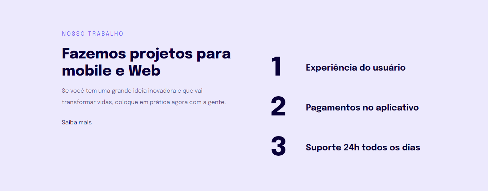
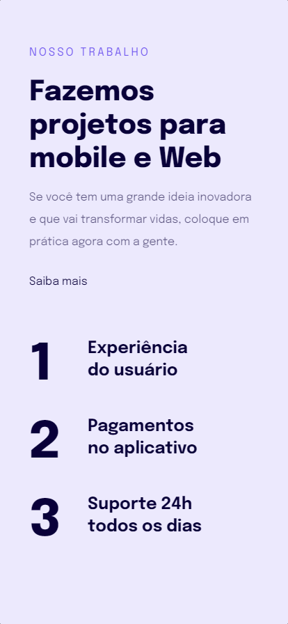

  <h1 align="center">Stage 03 - Introdução a Responsividade 🎨</h1>

## ✏️ Sobre

> Projeto desenvolvido no Stage 03 para aplicar conceitos de responsividade em uma página web.

 - Regra mobile-first ✔
 - Unidade de medida flexível ✔

## 💻 Desktop

## 📲 Mobile

## 🚀 Tecnologias

- HTML
- CSS

## 💻 Projeto

Para acessar o projeto clique no link abaixo:

[🔗 Clique aqui para acessar](https://brunakarina.github.io./projeto-04/)

## 📫 Contato

  
  

 

<h4 align="center">Made with 💙 by Bruna Karina 👋🏻</h4>